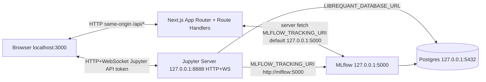

# LibreQuant — repository audit

**Generated:** evidence-backed static audit of the LibreQuant monorepo (Next.js shell under `librequant/`, Python library under `packages/librequant/`, Docker Compose at repository root).

**Methodology:** Files and behaviors cited below were inspected via direct reads, `find`, `wc -l`, `grep`, `npm outdated` (run from `librequant/`), and path globbing. This document does **not** claim a human read of every line of every file in the repository; every **finding** is tied to a **specific path** (and line numbers where applicable).

---

## Repository layout correction

- **No `librequant/src/`:** The Next.js application does not use a `src/` directory. Application code lives under [`librequant/app/`](librequant/app/), [`librequant/lib/`](librequant/lib/), and [`librequant/components/`](librequant/components/) (see directory tree below).
- **No root `package.json`:** Node dependencies and scripts are defined in [`librequant/package.json`](librequant/package.json) only.
- **No root `SECURITY.md`:** Security documentation is at [`librequant/SECURITY.md`](librequant/SECURITY.md).
- **No root `.env.example`:** The Next.js env template is [`librequant/.env.example`](librequant/.env.example). Docker Compose interpolation examples are at [`env.docker.example`](env.docker.example) (repository root).

---

## Directory tree

The following substitutes for a non-existent `librequant/src/` tree: three roots (`app`, `lib`, `components`) plus tooling and backend paths, to **three directory levels** where noted. Each **file** has a one-line purpose.

### `librequant/app/` (Next.js App Router)

| Path | Purpose |
|------|---------|
| [`librequant/app/layout.tsx`](librequant/app/layout.tsx) | Root layout: fonts, theme shell, skip link, global chrome. |
| [`librequant/app/page.tsx`](librequant/app/page.tsx) | Home route: notebook workbench / `HomeWorkspace`; opens notebooks via `?path=`. |
| [`librequant/app/loading.tsx`](librequant/app/loading.tsx) | Root loading UI for the app segment. |
| [`librequant/app/error.tsx`](librequant/app/error.tsx) | Root error boundary; logs error; shows `error.message` only in development (`NODE_ENV`). |
| [`librequant/app/globals.css`](librequant/app/globals.css) | Global CSS variables, Tailwind layers, shared workbench styling. |
| [`librequant/app/favicon.ico`](librequant/app/favicon.ico) | Favicon asset. |
| [`librequant/app/notebooks/page.tsx`](librequant/app/notebooks/page.tsx) | Notebook library route: list/open `.ipynb` under Jupyter contents root. |
| [`librequant/app/notebooks/loading.tsx`](librequant/app/notebooks/loading.tsx) | Loading state for notebook library segment. |
| [`librequant/app/strategies/page.tsx`](librequant/app/strategies/page.tsx) | Strategy library browser route. |
| [`librequant/app/strategies/loading.tsx`](librequant/app/strategies/loading.tsx) | Loading state for strategies index. |
| [`librequant/app/strategies/edit/page.tsx`](librequant/app/strategies/edit/page.tsx) | Strategy file editor route (Contents API). |
| [`librequant/app/strategies/edit/loading.tsx`](librequant/app/strategies/edit/loading.tsx) | Loading state for strategy editor. |
| [`librequant/app/data-sources/page.tsx`](librequant/app/data-sources/page.tsx) | Data sources: credentials UI, uploads, connector docs links. |
| [`librequant/app/data-sources/loading.tsx`](librequant/app/data-sources/loading.tsx) | Loading state for data sources. |
| [`librequant/app/data-sources/error.tsx`](librequant/app/data-sources/error.tsx) | Route-level error boundary for data sources. |
| [`librequant/app/experiments/page.tsx`](librequant/app/experiments/page.tsx) | MLflow experiments explorer; shareable `?experiment=`. |
| [`librequant/app/experiments/loading.tsx`](librequant/app/experiments/loading.tsx) | Loading state for experiments. |
| [`librequant/app/experiments/error.tsx`](librequant/app/experiments/error.tsx) | Route-level error boundary for experiments; always renders `error.message`. |
| [`librequant/app/documentation/page.tsx`](librequant/app/documentation/page.tsx) | In-app documentation (notebooks, data, strategies). |
| [`librequant/app/documentation/loading.tsx`](librequant/app/documentation/loading.tsx) | Loading state for documentation. |

#### `librequant/app/api/` (Route Handlers)

| Path | Purpose |
|------|---------|
| [`librequant/app/api/data-sources/credentials/route.ts`](librequant/app/api/data-sources/credentials/route.ts) | `POST`: merge managed/custom secrets into `.env.local`; sync to Jupyter via [`librequant/lib/jupyter-sync-secrets.ts`](librequant/lib/jupyter-sync-secrets.ts). |
| [`librequant/app/api/data-sources/status/route.ts`](librequant/app/api/data-sources/status/route.ts) | `GET`: non-secret presence flags for managed keys and custom env names. |
| [`librequant/app/api/mlflow/experiments/route.ts`](librequant/app/api/mlflow/experiments/route.ts) | `GET`: proxy MLflow experiments search to tracking server. |
| [`librequant/app/api/mlflow/experiments/route.test.ts`](librequant/app/api/mlflow/experiments/route.test.ts) | Vitest tests for experiments route behavior. |
| [`librequant/app/api/mlflow/runs/route.ts`](librequant/app/api/mlflow/runs/route.ts) | `GET`: resolve experiment by name, search runs, map REST → UI types. |
| [`librequant/app/api/mlflow/runs/[runId]/route.ts`](librequant/app/api/mlflow/runs/[runId]/route.ts) | `PATCH`: forward tag updates to MLflow `runs/update`. |
| [`librequant/app/api/mlflow/artifacts/list/route.ts`](librequant/app/api/mlflow/artifacts/list/route.ts) | `GET`: proxy artifact list for a run. |
| [`librequant/app/api/mlflow/artifacts/download/route.ts`](librequant/app/api/mlflow/artifacts/download/route.ts) | `GET`: proxy artifact bytes for browser-same-origin loads. |
| [`librequant/app/api/pypi/search/route.ts`](librequant/app/api/pypi/search/route.ts) | `GET`: PyPI HTML search + JSON API enrichment for package picker. |

### `librequant/lib/` (shared TypeScript modules)

| Path | Purpose |
|------|---------|
| [`librequant/lib/client-log.ts`](librequant/lib/client-log.ts) | Prefixed `console.warn` / `console.error` helpers for client logging. |
| [`librequant/lib/codemirror-auto-close-brackets.ts`](librequant/lib/codemirror-auto-close-brackets.ts) | Codemirror `closeBrackets` + transaction plumbing for Python editor. |
| [`librequant/lib/concurrent.ts`](librequant/lib/concurrent.ts) | Small concurrency helpers (e.g. limiting parallel async work). |
| [`librequant/lib/data-sources-status-context.tsx`](librequant/lib/data-sources-status-context.tsx) | React context for data-source credential presence / polling hooks. |
| [`librequant/lib/data-sources/constants.ts`](librequant/lib/data-sources/constants.ts) | UI constants for data sources feature. |
| [`librequant/lib/data-sources/custom-env-key.ts`](librequant/lib/data-sources/custom-env-key.ts) | Validation for custom env keys; `NOTEBOOK_DATABASE_URL_KEY` deprecated alias (lines 42–43). |
| [`librequant/lib/dev-server-socket-noise.ts`](librequant/lib/dev-server-socket-noise.ts) | Dev-server socket noise handlers (registered when [`librequant/next.config.ts`](librequant/next.config.ts) loads in development). |
| [`librequant/lib/ensure-webpack-public-path.ts`](librequant/lib/ensure-webpack-public-path.ts) | Ensures webpack public path for dynamic imports (JupyterLab styles). |
| [`librequant/lib/env.ts`](librequant/lib/env.ts) | Browser-safe env: Jupyter base URL/token, MLflow UI URL, strategy paths; `DEFAULT_LOCAL_JUPYTER_TOKEN` (line 54). |
| [`librequant/lib/experiments/experiments-url.ts`](librequant/lib/experiments/experiments-url.ts) | URL helpers for experiments route query params. |
| [`librequant/lib/experiments/use-experiment-query-sync.ts`](librequant/lib/experiments/use-experiment-query-sync.ts) | Hook to sync experiment selection with URL. |
| [`librequant/lib/format-date-time.ts`](librequant/lib/format-date-time.ts) | Date/time formatting helpers for UI. |
| [`librequant/lib/initial-notebook.ts`](librequant/lib/initial-notebook.ts) | Default empty notebook document shape. |
| [`librequant/lib/jupyter-contents.ts`](librequant/lib/jupyter-contents.ts) | Jupyter Contents API read/write/rename/list (large module, ~710 lines). |
| [`librequant/lib/jupyter-dev-noise.ts`](librequant/lib/jupyter-dev-noise.ts) | Dev-only filtering / monkey-patch of `console` for Jupyter/Yjs noise. |
| [`librequant/lib/jupyter-lab-styles.ts`](librequant/lib/jupyter-lab-styles.ts) | Dynamic imports of JupyterLab CSS chunks (includes `@jupyterlab/cells/style`). |
| [`librequant/lib/jupyter-notebook-phase.ts`](librequant/lib/jupyter-notebook-phase.ts) | Shared copy for notebook loading phases (connect vs kernel vs file). |
| [`librequant/lib/jupyter-paths.ts`](librequant/lib/jupyter-paths.ts) | Path joining helpers aligned with Jupyter workspace layout. |
| [`librequant/lib/jupyter-reachability-context.tsx`](librequant/lib/jupyter-reachability-context.tsx) | Reachability / connection state for Jupyter HTTP probe. |
| [`librequant/lib/jupyter-service-manager-context.tsx`](librequant/lib/jupyter-service-manager-context.tsx) | React context wrapping `@jupyterlab/services` session manager. |
| [`librequant/lib/jupyter-sync-secrets.ts`](librequant/lib/jupyter-sync-secrets.ts) | Sync `.env.local` secrets into workspace `config/credentials.env` via Contents API. |
| [`librequant/lib/kernel-lifecycle-events.ts`](librequant/lib/kernel-lifecycle-events.ts) | Kernel status event helpers. |
| [`librequant/lib/merge-env-local.ts`](librequant/lib/merge-env-local.ts) | Parse/merge `.env.local` without exposing values to client bundle. |
| [`librequant/lib/mlflow-client-error.ts`](librequant/lib/mlflow-client-error.ts) | Typed client errors for MLflow fetch failures. |
| [`librequant/lib/mlflow-client-error.test.ts`](librequant/lib/mlflow-client-error.test.ts) | Unit tests for MLflow client error mapping. |
| [`librequant/lib/mlflow-experiments-list.ts`](librequant/lib/mlflow-experiments-list.ts) | Helpers for experiment list fetching/polling. |
| [`librequant/lib/mlflow-http.ts`](librequant/lib/mlflow-http.ts) | MLflow proxy HTTP helpers: unreachable detection, upstream errors, loopback guard. |
| [`librequant/lib/mlflow-http.test.ts`](librequant/lib/mlflow-http.test.ts) | Unit tests for MLflow HTTP helper behavior. |
| [`librequant/lib/mlflow-map-run.ts`](librequant/lib/mlflow-map-run.ts) | Map MLflow REST run payloads to UI types. |
| [`librequant/lib/mlflow-server.ts`](librequant/lib/mlflow-server.ts) | Resolve `MLFLOW_TRACKING_URI` / `MLFLOW_API_BASE_URL`; `fetchMlflow` with timeout. |
| [`librequant/lib/mlflow-server.test.ts`](librequant/lib/mlflow-server.test.ts) | Unit tests for MLflow server URL resolution and fetch wrapper. |
| [`librequant/lib/notebook-constants.ts`](librequant/lib/notebook-constants.ts) | Notebook UI constants. |
| [`librequant/lib/notebook-id.ts`](librequant/lib/notebook-id.ts) | Notebook id / path parsing helpers. |
| [`librequant/lib/notebook-local-storage.ts`](librequant/lib/notebook-local-storage.ts) | Browser `localStorage` persistence for draft notebook JSON. |
| [`librequant/lib/notebook-onboarding.ts`](librequant/lib/notebook-onboarding.ts) | First-run / onboarding helpers for notebook UX. |
| [`librequant/lib/notebook-session-reset.ts`](librequant/lib/notebook-session-reset.ts) | Kernel restart / channel wait orchestration. |
| [`librequant/lib/notebook-store-content.ts`](librequant/lib/notebook-store-content.ts) | Notebook content store helpers (serialize/split). |
| [`librequant/lib/observe-mutations-raf.ts`](librequant/lib/observe-mutations-raf.ts) | `MutationObserver` + `requestAnimationFrame` batching utility. |
| [`librequant/lib/pip-install-via-kernel.ts`](librequant/lib/pip-install-via-kernel.ts) | Execute `pip install` in kernel for package search flow. |
| [`librequant/lib/pypi-name.ts`](librequant/lib/pypi-name.ts) | Normalize/validate PyPI package names. |
| [`librequant/lib/save-notebook-host-capabilities.ts`](librequant/lib/save-notebook-host-capabilities.ts) | Feature detection for File System Access API / download fallback. |
| [`librequant/lib/save-notebook-to-host.ts`](librequant/lib/save-notebook-to-host.ts) | Save `.ipynb` to host via picker or `<a download>` (`document.createElement`, lines 34–41). |
| [`librequant/lib/stores/experiment-explorer-store.ts`](librequant/lib/stores/experiment-explorer-store.ts) | Zustand store for experiment explorer selection and columns. |
| [`librequant/lib/stores/workbench-store.ts`](librequant/lib/stores/workbench-store.ts) | Zustand store for active sidebar section / workbench routing. |
| [`librequant/lib/strategy-contents.ts`](librequant/lib/strategy-contents.ts) | Strategy file read/write via Jupyter Contents API. |
| [`librequant/lib/types/mlflow.ts`](librequant/lib/types/mlflow.ts) | TypeScript types for MLflow REST ↔ UI mapping. |
| [`librequant/lib/types/notebook.ts`](librequant/lib/types/notebook.ts) | Notebook-related shared types. |
| [`librequant/lib/types/pypi.ts`](librequant/lib/types/pypi.ts) | PyPI search response types. |
| [`librequant/lib/types/strategy.ts`](librequant/lib/types/strategy.ts) | Strategy tree / file types. |
| [`librequant/lib/use-codemirror-auto-close-brackets.ts`](librequant/lib/use-codemirror-auto-close-brackets.ts) | Hook wiring auto-close brackets into Codemirror editor lifecycle. |
| [`librequant/lib/use-has-mounted.ts`](librequant/lib/use-has-mounted.ts) | Client-only mount guard hook. |
| [`librequant/lib/use-jupyter-kernel-connection-status.ts`](librequant/lib/use-jupyter-kernel-connection-status.ts) | Hook: kernel connection status + `console.info` on transitions (documented in file). |
| [`librequant/lib/use-jupyter-service-manager.ts`](librequant/lib/use-jupyter-service-manager.ts) | Hook accessor for Jupyter service manager context. |
| [`librequant/lib/use-notebook-host-shortcuts.ts`](librequant/lib/use-notebook-host-shortcuts.ts) | Keyboard shortcuts for notebook host actions. |
| [`librequant/lib/use-notebook-local-persistence.ts`](librequant/lib/use-notebook-local-persistence.ts) | Hook: autosave draft to `localStorage` with warnings on serialize failure. |
| [`librequant/lib/use-notebook-server-persistence.ts`](librequant/lib/use-notebook-server-persistence.ts) | Hook: save notebook to Jupyter server path. |
| [`librequant/lib/use-persisted-expanded-set.ts`](librequant/lib/use-persisted-expanded-set.ts) | Hook: persist expanded tree node ids. |
| [`librequant/lib/use-strategy-path-injection.ts`](librequant/lib/use-strategy-path-injection.ts) | Kernel `executeCode` for `sys.path` injection + validated paths ([`librequant/lib/env.ts`](librequant/lib/env.ts) alignment). |

### `librequant/components/` (React UI, depth ≤3)

| Path | Purpose |
|------|---------|
| [`librequant/components/providers.tsx`](librequant/components/providers.tsx) | App-wide client providers (theme, Jupyter reachability stack). |
| [`librequant/components/theme-provider.tsx`](librequant/components/theme-provider.tsx) | `next-themes` provider wiring. |
| [`librequant/components/theme-toggle.tsx`](librequant/components/theme-toggle.tsx) | Light/dark toggle control. |
| [`librequant/components/workbench-shell.tsx`](librequant/components/workbench-shell.tsx) | Main workbench chrome: sidebar + header + section titles. |
| [`librequant/components/workbench-loading-shell.tsx`](librequant/components/workbench-loading-shell.tsx) | Loading placeholder inside workbench layout. |
| [`librequant/components/home-workspace.tsx`](librequant/components/home-workspace.tsx) | Home section: embeds notebook workbench for default route. |
| [`librequant/components/internal-documentation.tsx`](librequant/components/internal-documentation.tsx) | Renders in-app documentation content. |
| [`librequant/components/sidebar-experiments.tsx`](librequant/components/sidebar-experiments.tsx) | Sidebar MLflow experiments list + links. |
| [`librequant/components/sidebar-notebook-tree.tsx`](librequant/components/sidebar-notebook-tree.tsx) | Sidebar notebook file tree / navigation. |
| [`librequant/components/sidebar-strategy-tree.tsx`](librequant/components/sidebar-strategy-tree.tsx) | Sidebar strategy tree / navigation. |
| [`librequant/components/sidebar-data-ingestors.tsx`](librequant/components/sidebar-data-ingestors.tsx) | Sidebar data-ingestor controls (~612 lines). |
| [`librequant/components/sidebar-data-ingestors.client.tsx`](librequant/components/sidebar-data-ingestors.client.tsx) | Client-only split for sidebar ingestors. |
| [`librequant/components/data-library-manager.tsx`](librequant/components/data-library-manager.tsx) | Data library + uploads UI (~1435 lines). |
| [`librequant/components/data-library-manager.client.tsx`](librequant/components/data-library-manager.client.tsx) | Client-only entry for data library manager. |
| [`librequant/components/data-sources/data-sources-panel.tsx`](librequant/components/data-sources/data-sources-panel.tsx) | Credentials form + validation + status polling (~1140 lines). |
| [`librequant/components/package-search/package-search-modal.tsx`](librequant/components/package-search/package-search-modal.tsx) | Modal shell for PyPI-driven pip install. |
| [`librequant/components/package-search/package-search-panel.tsx`](librequant/components/package-search/package-search-panel.tsx) | Search UI inside modal (~301 lines). |
| [`librequant/components/package-search/notebook-pip-types.ts`](librequant/components/package-search/notebook-pip-types.ts) | Shared types for pip-install flow. |
| [`librequant/components/notebook/jupyter-provider.tsx`](librequant/components/notebook/jupyter-provider.tsx) | `@datalayer/jupyter-react` provider + service manager wiring. |
| [`librequant/components/notebook/jupyter-workbench.tsx`](librequant/components/notebook/jupyter-workbench.tsx) | Notebook editor host: cells, kernel, Yjs bridge (~379 lines). |
| [`librequant/components/notebook/jupyter-connecting-panel.tsx`](librequant/components/notebook/jupyter-connecting-panel.tsx) | UI while connecting to Jupyter server. |
| [`librequant/components/notebook/jupyter-theme-link.tsx`](librequant/components/notebook/jupyter-theme-link.tsx) | Injects Jupyter theme `<link>` into `document.head`. |
| [`librequant/components/notebook/jupyter-transport-banner.tsx`](librequant/components/notebook/jupyter-transport-banner.tsx) | Banner for transport / connection issues. |
| [`librequant/components/notebook/libre-notebook-toolbar.tsx`](librequant/components/notebook/libre-notebook-toolbar.tsx) | Notebook toolbar actions (~358 lines). |
| [`librequant/components/notebook/libre-cell-sidebar.tsx`](librequant/components/notebook/libre-cell-sidebar.tsx) | Per-cell sidebar; imports type `ICellModel` from `@jupyterlab/cells` (line 3). |
| [`librequant/components/notebook/notebook-workbench-context.tsx`](librequant/components/notebook/notebook-workbench-context.tsx) | React context for active notebook path / workbench state. |
| [`librequant/components/notebook/notebook-loading-state.tsx`](librequant/components/notebook/notebook-loading-state.tsx) | Phased loading UI for notebook open flow. |
| [`librequant/components/notebook/notebook-save-status-bar.tsx`](librequant/components/notebook/notebook-save-status-bar.tsx) | Save status / dirty indicators. |
| [`librequant/components/notebook/output-sanitizer.tsx`](librequant/components/notebook/output-sanitizer.tsx) | Sanitize HTML cell output via DOMPurify + `innerHTML` assignment. |
| [`librequant/components/notebooks/notebook-library-panel.tsx`](librequant/components/notebooks/notebook-library-panel.tsx) | Notebook library grid/list + actions (~851 lines). |
| [`librequant/components/strategies/python-code-editor.tsx`](librequant/components/strategies/python-code-editor.tsx) | Codemirror-based Python strategy editor. |
| [`librequant/components/strategies/strategy-editor-shell.tsx`](librequant/components/strategies/strategy-editor-shell.tsx) | Strategy editor layout + save orchestration (~358 lines). |
| [`librequant/components/strategies/strategy-file-tree.tsx`](librequant/components/strategies/strategy-file-tree.tsx) | Strategy file tree + CRUD + `document` listeners (~955 lines). |
| [`librequant/components/strategies/strategy-library-panel.tsx`](librequant/components/strategies/strategy-library-panel.tsx) | Strategy library list/create/delete (~475 lines). |
| [`librequant/components/experiments/experiment-explorer.tsx`](librequant/components/experiments/experiment-explorer.tsx) | MLflow runs table / run detail explorer (~625 lines). |

### `librequant/scripts/`, `librequant/types/`, and app root config

| Path | Purpose |
|------|---------|
| [`librequant/scripts/ensure-env.mjs`](librequant/scripts/ensure-env.mjs) | Ensures `.env.local` exists before dev/build (`predev` / `prebuild`). |
| [`librequant/scripts/copy-jupyter-theme-css.mjs`](librequant/scripts/copy-jupyter-theme-css.mjs) | Copies Jupyter theme CSS for bundling. |
| [`librequant/scripts/stack-common.mjs`](librequant/scripts/stack-common.mjs) | Shared helpers for dev/prod stack scripts (URL probes). |
| [`librequant/scripts/dev-stack.mjs`](librequant/scripts/dev-stack.mjs) | `npm run dev:stack`: compose up + wait for Jupyter + `next dev`. |
| [`librequant/scripts/prod-stack.mjs`](librequant/scripts/prod-stack.mjs) | `npm run prod:stack`: compose + production Next server. |
| [`librequant/types/jupyterlab-style-modules.d.ts`](librequant/types/jupyterlab-style-modules.d.ts) | Ambient module declarations for JupyterLab style imports. |
| [`librequant/next.config.ts`](librequant/next.config.ts) | Next config: CSP headers, Jupyter/MLflow origins, `transpilePackages`, `reactStrictMode: false` (commented rationale); in dev, registers socket noise handlers (Node-only). |
| [`librequant/tsconfig.json`](librequant/tsconfig.json) | TypeScript project: `strict: true`, `skipLibCheck: true`, path alias `@/*`. |
| [`librequant/tailwind.config.ts`](librequant/tailwind.config.ts) | Tailwind v4 configuration. |
| [`librequant/postcss.config.mjs`](librequant/postcss.config.mjs) | PostCSS pipeline for Tailwind. |
| [`librequant/eslint.config.mjs`](librequant/eslint.config.mjs) | Flat ESLint config: **only** spreads `eslint-config-next` (see dependency notes). |
| [`librequant/vitest.config.ts`](librequant/vitest.config.ts) | Vitest runner configuration. |

### Repository root, Docker, Python package, docs

| Path | Purpose |
|------|---------|
| [`docker-compose.yml`](docker-compose.yml) | Postgres, `mlflow-db-init`, MLflow server, Jupyter; loopback port maps; Jupyter command sets token/CORS/XSRF flags. |
| [`Makefile`](Makefile) | Targets: `compose-up`, `librequant-build`, `prod`, `prod-build`, `gemini-copy`. |
| [`env.docker.example`](env.docker.example) | Documents repo-root `.env` keys for Compose (workspace host, Postgres overrides). |
| [`docker/jupyter/Dockerfile`](docker/jupyter/Dockerfile) | Jupyter image: pre-installs deps from `packages/librequant/pyproject.toml`. |
| [`docker/mlflow/Dockerfile`](docker/mlflow/Dockerfile) | MLflow server image build (psycopg2 for SQLAlchemy Postgres store). |
| [`docker/postgres/init-mlflow-db.sql`](docker/postgres/init-mlflow-db.sql) | Postgres init: ensure `mlflow` DB on first cluster init. |
| [`packages/librequant/pyproject.toml`](packages/librequant/pyproject.toml) | Python package metadata, optional `postgres` / `mlflow` / `dev` extras, ruff/mypy config. |
| [`packages/librequant/librequant/__init__.py`](packages/librequant/librequant/__init__.py) | Package public exports. |
| [`packages/librequant/librequant/tracking.py`](packages/librequant/librequant/tracking.py) | Tracking / experiment helpers (Python). |
| [`packages/librequant/librequant/mlflow_registry.py`](packages/librequant/librequant/mlflow_registry.py) | MLflow registry interactions from notebooks. |
| [`packages/librequant/librequant/data/__init__.py`](packages/librequant/librequant/data/__init__.py) | Data subpackage exports (`get_bars`, etc.). |
| [`packages/librequant/librequant/data/bars.py`](packages/librequant/librequant/data/bars.py) | OHLCV bar fetch orchestration. |
| [`packages/librequant/librequant/data/cache.py`](packages/librequant/librequant/data/cache.py) | Local Parquet cache for market data. |
| [`packages/librequant/librequant/data/credential_env.py`](packages/librequant/librequant/data/credential_env.py) | Load merged credentials for connectors. |
| [`packages/librequant/librequant/data/paths.py`](packages/librequant/librequant/data/paths.py) | Workspace path resolution inside Jupyter. |
| [`packages/librequant/librequant/data/postgres.py`](packages/librequant/librequant/data/postgres.py) | Postgres access helpers. |
| [`packages/librequant/librequant/data/tabular.py`](packages/librequant/librequant/data/tabular.py) | Tabular IO helpers. |
| [`packages/librequant/librequant/data/connectors/alpaca.py`](packages/librequant/librequant/data/connectors/alpaca.py) | Alpaca market data connector. |
| [`packages/librequant/librequant/data/connectors/polygon.py`](packages/librequant/librequant/data/connectors/polygon.py) | Polygon connector stub/planned. |
| [`packages/librequant/librequant/data/connectors/tiingo.py`](packages/librequant/librequant/data/connectors/tiingo.py) | Tiingo connector stub/planned. |
| [`packages/librequant/librequant/data/connectors/yfinance.py`](packages/librequant/librequant/data/connectors/yfinance.py) | yfinance-backed OHLCV source. |
| [`docs/index.html`](docs/index.html) | Static marketing/docs page; Tailwind CDN; theme toggle script. |

---

## Architecture diagram (Mermaid)

Ports and host bindings are taken from [`docker-compose.yml`](docker-compose.yml) and defaults in [`librequant/.env.example`](librequant/.env.example) / [`librequant/lib/env.ts`](librequant/lib/env.ts) / [`librequant/lib/mlflow-server.ts`](librequant/lib/mlflow-server.ts).

**Notes (path-backed):**

- [`librequant/next.config.ts`](librequant/next.config.ts) builds a `Content-Security-Policy` with `connect-src` including the Jupyter HTTP and WS origins and `frame-src` including the public MLflow UI origin from [`librequant/lib/env.ts`](librequant/lib/env.ts).
- [`docker-compose.yml`](docker-compose.yml) publishes **Postgres** on `127.0.0.1:${POSTGRES_HOST_PORT:-5432}:5432`, **MLflow** on `127.0.0.1:5000:5000`, **Jupyter** on `127.0.0.1:8888:8888`.
- Inside the Compose network, Jupyter uses hostname **`postgres`** and **`mlflow`** in environment variables (same file, `jupyter.environment`).

---

## Dependency inventory

**Source of truth:** [`librequant/package.json`](librequant/package.json). **`npm outdated`** was run from `librequant/` when this audit was produced; versions below reflect that output. A refresh timestamp and raw `npm outdated` / `depcheck` notes appear in [Appendix: dependency tooling refresh](#appendix-dependency-tooling-refresh).

### Runtime (`dependencies`)

| Package | In `package.json` | Used? | Evidence / notes |
|---------|-------------------|--------|------------------|
| `next` | `16.2.3` | (a) Used | Entire `librequant/app/` App Router. |
| `react` / `react-dom` | `19.2.0` | (a) Used | All `librequant/components/**/*.tsx`. |
| `@datalayer/jupyter-react` | `^2.0.5` | (a) Used | e.g. [`librequant/components/notebook/jupyter-provider.tsx`](librequant/components/notebook/jupyter-provider.tsx). |
| `@jupyterlab/services` | `^7.4.9` | (a) Used | e.g. [`librequant/lib/jupyter-service-manager-context.tsx`](librequant/lib/jupyter-service-manager-context.tsx). |
| `@jupyterlab/cells` | *(not direct)* | Transitive / implicit | Type-only import in [`librequant/components/notebook/libre-cell-sidebar.tsx`](librequant/components/notebook/libre-cell-sidebar.tsx) line 3; styles import in [`librequant/lib/jupyter-lab-styles.ts`](librequant/lib/jupyter-lab-styles.ts); resolved via lockfile (`librequant/package-lock.json` shows `@jupyterlab/cells`). Risk: version drift vs direct `@jupyterlab/services` pin. |
| `codemirror` | `^6.0.2` | (a) Used | [`librequant/components/strategies/python-code-editor.tsx`](librequant/components/strategies/python-code-editor.tsx). |
| `@codemirror/lang-python` | `^6.2.1` | (a) Used | Same file. |
| `@codemirror/state` | `^6.6.0` | (a) Used | `python-code-editor.tsx`, [`librequant/lib/codemirror-auto-close-brackets.ts`](librequant/lib/codemirror-auto-close-brackets.ts). |
| `@codemirror/view` | `^6.41.0` | (a) Used | Same. |
| `@codemirror/autocomplete` | `^6.20.1` | (a) Used | [`librequant/lib/codemirror-auto-close-brackets.ts`](librequant/lib/codemirror-auto-close-brackets.ts). |
| `@codemirror/theme-one-dark` | `^6.1.3` | (a) Used | [`librequant/components/strategies/python-code-editor.tsx`](librequant/components/strategies/python-code-editor.tsx). |
| `dompurify` | `^3.2.5` | (a) Used | [`librequant/components/notebook/output-sanitizer.tsx`](librequant/components/notebook/output-sanitizer.tsx). |
| `lucide-react` | `^0.487.0` | (a) Used | Many components (icons). |
| `next-themes` | `^0.4.6` | (a) Used | [`librequant/components/theme-provider.tsx`](librequant/components/theme-provider.tsx). |
| `zustand` | `^5.0.3` | (a) Used | [`librequant/lib/stores/workbench-store.ts`](librequant/lib/stores/workbench-store.ts), [`librequant/lib/stores/experiment-explorer-store.ts`](librequant/lib/stores/experiment-explorer-store.ts). |

**(c) Duplicated purpose (intentional stack, not duplicate npm entries):** `codemirror` + `@codemirror/*` (editor ecosystem); `@datalayer/jupyter-react` + `@jupyterlab/services` (high-level React integration vs protocol client).

**(b) Unused / dead (direct dependency):** `@eslint/eslintrc` in [`librequant/package.json`](librequant/package.json) line 37 — **not imported** by [`librequant/eslint.config.mjs`](librequant/eslint.config.mjs), which only spreads `eslint-config-next`. Listed as dead unless a future ESLint config imports it explicitly.

**`@types/dompurify`:** devDependency in [`librequant/package.json`](librequant/package.json); `dompurify` v3 may ship its own types — treat as **possibly redundant**; verify before removal (no automated check in this audit).

### Dev (`devDependencies`)

| Package | `npm outdated` (Current → Latest) | Note |
|---------|----------------------------------|------|
| `typescript` | 5.9.3 → **6.0.3** | **>1 major** behind Latest per registry. |
| `vitest` | 3.2.4 → **4.1.5** | **>1 major** behind Latest. |
| `eslint` | 9.39.4 → **10.3.0** | **>1 major** behind Latest. |
| `@types/node` | 20.19.37 → Wanted 20.19.39; Latest **25.6.0** | **>1 major** line (20 → 25) when tracking Latest. |
| `lucide-react` | 0.487.0 → **1.14.0** | **Major** semver line change (0.x → 1.x). |
| `next` | 16.2.3 → 16.2.4 | Patch only. |
| `eslint-config-next` | 16.2.3 → 16.2.4 | Patch only. |
| `react` / `react-dom` | 19.2.0 → 19.2.5 | Patch only. |
| `dompurify` | 3.3.3 → 3.4.2 | Minor/patch (resolved version in `node_modules` per `npm outdated`). |
| `@codemirror/view` | 6.41.0 → 6.41.1 | Patch. |
| `@jupyterlab/services` | 7.5.6 → 7.5.7 | Patch. |
| `@tailwindcss/postcss` / `tailwindcss` | 4.2.2 → 4.2.4 | Patch. |

### Env vars: two names, one concept

[`librequant/lib/mlflow-server.ts`](librequant/lib/mlflow-server.ts) lines 14–20: `MLFLOW_TRACKING_URI` **or** `MLFLOW_API_BASE_URL` resolve the same server base URL. [`librequant/.env.example`](librequant/.env.example) documents `MLFLOW_TRACKING_URI` (commented) but **does not** mention `MLFLOW_API_BASE_URL` — configuration duplication without template parity (see smells / `.env.example` gap).

### Python package ([`packages/librequant/pyproject.toml`](packages/librequant/pyproject.toml))

Core: `pandas`, `pyarrow`, `python-dotenv`, `yfinance`, `requests`, `openpyxl`. Optional: `postgres` (`psycopg`), `mlflow` (pin `mlflow==2.22.4`), `dev` (`pytest`, `ruff`, `mypy`, stubs). All map to modules under [`packages/librequant/librequant/`](packages/librequant/librequant/); no separate npm-style unused scan was run for Python.

---

## Code smells and tech debt

Each item: **path**, **line range**, **problem**, **severity**, **one-sentence fix**.

| Path | Lines | Problem | Severity | Fix |
|------|-------|---------|----------|-----|
| [`librequant/components/data-library-manager.tsx`](librequant/components/data-library-manager.tsx) | 1–1435 | God component: uploads, listing, Jupyter operations, many `console.error` call sites. | High | Split into feature modules (upload pipeline, table, actions) + shared hooks. |
| [`librequant/components/data-sources/data-sources-panel.tsx`](librequant/components/data-sources/data-sources-panel.tsx) | 1–1140 | God component: credential forms, custom keys, fetch orchestration. | High | Extract form sections + hooks; reduce cross-cutting state in one file. |
| [`librequant/components/strategies/strategy-file-tree.tsx`](librequant/components/strategies/strategy-file-tree.tsx) | 1–955 | God component; `document.addEventListener` / `window.confirm` for destructive actions. | High | Split tree vs dialogs; replace `confirm` with in-app modal where feasible. |
| [`librequant/components/notebooks/notebook-library-panel.tsx`](librequant/components/notebooks/notebook-library-panel.tsx) | 1–851 | God component for notebook library CRUD and layout. | Medium | Separate list, toolbar, and delete flows into child components + hooks. |
| [`librequant/lib/jupyter-contents.ts`](librequant/lib/jupyter-contents.ts) | 1–710 | Very large Contents API surface in one module. | Medium | Split read vs write vs rename vs listing helpers. |
| [`librequant/components/experiments/experiment-explorer.tsx`](librequant/components/experiments/experiment-explorer.tsx) | 1–625 | Large explorer (runs, metrics, artifacts UI). | Medium | Decompose table, detail pane, and fetch layers. |
| [`librequant/components/sidebar-data-ingestors.tsx`](librequant/components/sidebar-data-ingestors.tsx) | 1–612 | Large sidebar surface. | Medium | One component per ingestor type under `components/`. |
| [`librequant/components/strategies/strategy-library-panel.tsx`](librequant/components/strategies/strategy-library-panel.tsx) | 1–475 | Large strategy library panel. | Medium | Extract create/delete flows and list rendering. |
| [`librequant/components/notebook/jupyter-workbench.tsx`](librequant/components/notebook/jupyter-workbench.tsx) | 1–379 | Large notebook host wiring Yjs/kernel/UI. | Medium | Isolate toolbar vs cell list vs status subscriptions. |
| [`librequant/components/strategies/strategy-editor-shell.tsx`](librequant/components/strategies/strategy-editor-shell.tsx) | 1–358 | Editor shell + persistence + errors in one file. | Medium | Move persistence to hooks; keep shell presentational. |
| [`librequant/components/notebook/libre-notebook-toolbar.tsx`](librequant/components/notebook/libre-notebook-toolbar.tsx) | 1–358 | Toolbar aggregates many actions. | Medium | Split run/save/kernel controls into subcomponents. |
| [`librequant/components/package-search/package-search-panel.tsx`](librequant/components/package-search/package-search-panel.tsx) | 1–301 | At threshold of “god” size for a panel. | Low | Extract search input + results list. |
| [`librequant/app/api/mlflow/experiments/route.ts`](librequant/app/api/mlflow/experiments/route.ts) + other `app/api/mlflow/**` | various | Duplicated pattern: `mlflowProxyForbiddenIfRequired` → `getMlflowServerBaseUrl` → `fetchMlflow` → shared error helpers. | Medium | Introduce a small wrapper (e.g. `withMlflowProxy`) to DRY handlers. |
| [`librequant/app/api/mlflow/runs/[runId]/route.ts`](librequant/app/api/mlflow/runs/[runId]/route.ts) | 29–32, 36–42 | `await request.json()` cast to `PatchBody` without schema for tag keys/value sizes. | Medium | Add Zod/Valibot: max tags, key charset, max value length before proxying. |
| [`librequant/app/api/mlflow/experiments/route.ts`](librequant/app/api/mlflow/experiments/route.ts) | 44–46 | 500 JSON includes `detail: String(e)` — may leak stack/message to any caller of the API. | Medium | Log server-side; return generic error body to clients. |
| [`librequant/app/api/mlflow/runs/route.ts`](librequant/app/api/mlflow/runs/route.ts) | 82–84 | Same `detail: String(e)` pattern on unexpected errors. | Medium | Same as above. |
| [`librequant/app/api/mlflow/artifacts/list/route.ts`](librequant/app/api/mlflow/artifacts/list/route.ts) | 46–48 | Same pattern. | Medium | Same as above. |
| [`librequant/app/api/mlflow/artifacts/download/route.ts`](librequant/app/api/mlflow/artifacts/download/route.ts) | 53–55 | Same pattern. | Medium | Same as above. |
| [`librequant/app/api/mlflow/runs/[runId]/route.ts`](librequant/app/api/mlflow/runs/[runId]/route.ts) | 70–72 | Same pattern. | Medium | Same as above. |
| [`librequant/app/experiments/error.tsx`](librequant/app/experiments/error.tsx) | 24–25 | Always renders `error.message` in production (unlike [`librequant/app/error.tsx`](librequant/app/error.tsx) lines 16–34 which gate on `NODE_ENV`). | Medium | Match root error UX: hide message outside development. |
| [`librequant/components/notebook/output-sanitizer.tsx`](librequant/components/notebook/output-sanitizer.tsx) | 26–29 | Assigns `innerHTML` after sanitize — still direct DOM write from React. | Low | Keep strict DOMPurify config; consider `sanitize` + `TrustedHTML` policy if tightening further. |
| [`librequant/components/notebook/jupyter-theme-link.tsx`](librequant/components/notebook/jupyter-theme-link.tsx) | 17–24 | `document.getElementById` / `createElement` / `appendChild` for dynamic stylesheet. | Low | Acceptable pattern; document as intentional or isolate in `useEffect` utility module. |
| [`librequant/lib/save-notebook-to-host.ts`](librequant/lib/save-notebook-to-host.ts) | 34–41 | `document.createElement("a")` download fallback. | Low | Standard pattern for download triggers; keep encapsulated (already is). |
| [`librequant/lib/jupyter-dev-noise.ts`](librequant/lib/jupyter-dev-noise.ts) | 58–70 | Replaces global `console.log/warn/error` in development. | Low | Ensure only imported on dev paths; document interaction with other logging. |
| [`librequant/components/data-library-manager.tsx`](librequant/components/data-library-manager.tsx) | multiple | Frequent `console.error(e)` in catch blocks (grep-backed). | Low | Route through [`librequant/lib/client-log.ts`](librequant/lib/client-log.ts) or structured logger with levels. |
| [`librequant/app/error.tsx`](librequant/app/error.tsx) | 13 | `console.error` in `useEffect` for route errors. | Low | Acceptable; pair with server logging if moving beyond local-only. |
| [`librequant/lib/env.ts`](librequant/lib/env.ts) | 119, 155 | `console.warn` for configuration issues. | Low | Consider single client/server logger abstraction. |
| [`librequant/tsconfig.json`](librequant/tsconfig.json) | 6–7 | `strict: true` but `skipLibCheck: true` skips `.d.ts` validation. | Low | Tradeoff for build speed; tighten if type noise from deps is manageable. |
| [`librequant/tsconfig.json`](librequant/tsconfig.json) | 7 | `"strict": true` enabled; workspace search found no `@ts-ignore` / `@ts-expect-error` / `: any` / `as any` in `librequant/**/*.ts` and `librequant/**/*.tsx` at audit time. | Info | Positive signal for strictness; enforce with `tsc --noEmit` in CI. |
| [`librequant/next.config.ts`](librequant/next.config.ts) | 22–28 | CSP allows `'unsafe-inline'`, `'unsafe-eval'`, and extra `https://cdnjs.cloudflare.com` for Jupyter widgets. | Medium (contextual) | Documented tradeoff for local Jupyter; tighten only if deployment model changes ([`librequant/SECURITY.md`](librequant/SECURITY.md)). |
| [`librequant/SECURITY.md`](librequant/SECURITY.md) | 17–27 | `/api/data-sources/*` and `/api/mlflow/*` have no app auth (local trust model). | High *if mis-deployed* | For OSS enterprise story: document loopback binding + optional `MLFLOW_PROXY_REQUIRE_LOOPBACK` ([`librequant/lib/mlflow-http.ts`](librequant/lib/mlflow-http.ts)). |
| [`docker-compose.yml`](docker-compose.yml) | 93–158 | `jupyter` service has **no** `healthcheck` (unlike `postgres` lines 15–21 and `mlflow` lines 82–91). | Medium | Add HTTP health probe so dependent tooling can wait on Jupyter readiness explicitly. |
| [`docker-compose.yml`](docker-compose.yml) | all services | No `deploy.resources` limits (cpus/memory). | Low | Add conservative limits for laptop OSS users. |
| [`librequant/.env.example`](librequant/.env.example) | — | Omits `MLFLOW_API_BASE_URL` documented only in code at [`librequant/lib/mlflow-server.ts`](librequant/lib/mlflow-server.ts). | Low | Add commented `MLFLOW_API_BASE_URL` with explanation of fallback order. |
| [`librequant/lib/data-sources/custom-env-key.ts`](librequant/lib/data-sources/custom-env-key.ts) | 42–43 | Deprecated alias `NOTEBOOK_DATABASE_URL_KEY`. | Low | Remove after migration window or keep single exported name. |
| [`librequant/app/notebooks/`](librequant/app/notebooks/) | — | No `error.tsx` under notebooks segment (only [`librequant/app/error.tsx`](librequant/app/error.tsx) global). | Medium | Add [`librequant/app/notebooks/error.tsx`](librequant/app/notebooks/error.tsx) for localized recovery UX. |
| [`librequant/app/strategies/`](librequant/app/strategies/) | — | No `error.tsx` under strategies segment. | Medium | Add [`librequant/app/strategies/error.tsx`](librequant/app/strategies/error.tsx). |
| [`librequant/app/documentation/`](librequant/app/documentation/) | — | No `error.tsx` under documentation segment. | Medium | Add [`librequant/app/documentation/error.tsx`](librequant/app/documentation/error.tsx). |
| [`docs/index.html`](docs/index.html) | 34 | Loads Tailwind from `https://cdn.tailwindcss.com` (third-party script). | Low | Acceptable for static docs; note supply chain if hosting hardens. |
| [`docker-compose.yml`](docker-compose.yml) | 154–158 | Jupyter starts with `--IdentityProvider.token=devtoken`, `ServerApp.disable_check_xsrf=True`, CORS allowlist for `:3000`. | High *if exposed* | Local-dev tradeoff explicitly described in [`librequant/SECURITY.md`](librequant/SECURITY.md) lines 29–33; do not publish `8888` beyond loopback. |

---

## Testing status

### Existing automated tests

**TypeScript / Vitest (under `librequant/`):**

- [`librequant/lib/mlflow-http.test.ts`](librequant/lib/mlflow-http.test.ts)
- [`librequant/lib/mlflow-server.test.ts`](librequant/lib/mlflow-server.test.ts)
- [`librequant/lib/mlflow-client-error.test.ts`](librequant/lib/mlflow-client-error.test.ts)
- [`librequant/app/api/mlflow/experiments/route.test.ts`](librequant/app/api/mlflow/experiments/route.test.ts)

**Python / pytest (under `packages/librequant/tests/`):**

- [`packages/librequant/tests/test_cache_paths.py`](packages/librequant/tests/test_cache_paths.py)
- [`packages/librequant/tests/test_credential_env.py`](packages/librequant/tests/test_credential_env.py)

### Critical paths with zero or minimal automated coverage (explicit)

| Area | Paths | Why it matters |
|------|-------|----------------|
| Jupyter integration | [`librequant/components/notebook/jupyter-provider.tsx`](librequant/components/notebook/jupyter-provider.tsx), [`librequant/components/notebook/jupyter-workbench.tsx`](librequant/components/notebook/jupyter-workbench.tsx), [`librequant/lib/jupyter-service-manager-context.tsx`](librequant/lib/jupyter-service-manager-context.tsx) | Core user value; failures are runtime/network/protocol heavy. |
| Notebook persistence | [`librequant/lib/use-notebook-server-persistence.ts`](librequant/lib/use-notebook-server-persistence.ts), [`librequant/lib/use-notebook-local-persistence.ts`](librequant/lib/use-notebook-local-persistence.ts), [`librequant/lib/jupyter-contents.ts`](librequant/lib/jupyter-contents.ts) | Data loss risk; no dedicated tests found. |
| Credential API | [`librequant/app/api/data-sources/credentials/route.ts`](librequant/app/api/data-sources/credentials/route.ts), [`librequant/lib/merge-env-local.ts`](librequant/lib/merge-env-local.ts) | Writes secrets to disk; no `*.test.ts` co-located. |
| PyPI proxy | [`librequant/app/api/pypi/search/route.ts`](librequant/app/api/pypi/search/route.ts) | External HTML/JSON dependency; no tests found. |
| MLflow proxies (beyond experiments GET) | [`librequant/app/api/mlflow/runs/route.ts`](librequant/app/api/mlflow/runs/route.ts), [`librequant/app/api/mlflow/runs/[runId]/route.ts`](librequant/app/api/mlflow/runs/[runId]/route.ts), [`librequant/app/api/mlflow/artifacts/list/route.ts`](librequant/app/api/mlflow/artifacts/list/route.ts), [`librequant/app/api/mlflow/artifacts/download/route.ts`](librequant/app/api/mlflow/artifacts/download/route.ts) | Only experiments route has [`route.test.ts`](librequant/app/api/mlflow/experiments/route.test.ts). |
| Large UI surfaces | [`librequant/components/data-library-manager.tsx`](librequant/components/data-library-manager.tsx), [`librequant/components/data-sources/data-sources-panel.tsx`](librequant/components/data-sources/data-sources-panel.tsx) | No component tests located in repo. |
| Python connectors / IO | [`packages/librequant/librequant/data/connectors/alpaca.py`](packages/librequant/librequant/data/connectors/alpaca.py), [`packages/librequant/librequant/data/bars.py`](packages/librequant/librequant/data/bars.py), [`packages/librequant/librequant/data/postgres.py`](packages/librequant/librequant/data/postgres.py), [`packages/librequant/librequant/data/connectors/yfinance.py`](packages/librequant/librequant/data/connectors/yfinance.py) | No matching `test_*.py` beyond cache/credential env tests. |

---

## Summary verdict

Top five refactors for **enterprise-quality open source** that still **runs locally via Docker**, ranked by **value vs effort**:

1. **Decompose god components** — [`librequant/components/data-library-manager.tsx`](librequant/components/data-library-manager.tsx), [`librequant/components/data-sources/data-sources-panel.tsx`](librequant/components/data-sources/data-sources-panel.tsx), [`librequant/components/strategies/strategy-file-tree.tsx`](librequant/components/strategies/strategy-file-tree.tsx): **very high value** for maintainability and testability; **high effort**.

2. **Integration smoke test (Docker + browser)** — One scripted flow (e.g. Playwright or a minimal shell script) that asserts Compose health, loads `localhost:3000`, and touches one Jupyter and one MLflow-backed path: **high value** for OSS confidence; **medium effort**.

3. **API hardening and observability** — Schema validation on [`librequant/app/api/mlflow/runs/[runId]/route.ts`](librequant/app/api/mlflow/runs/[runId]/route.ts); remove `String(e)` from client-visible 500 bodies across `app/api/mlflow/**`; unit tests for [`librequant/app/api/data-sources/credentials/route.ts`](librequant/app/api/data-sources/credentials/route.ts): **high value** when users expose ports beyond strict loopback; **medium effort**.

4. **Compose operational polish** — Add Jupyter `healthcheck` in [`docker-compose.yml`](docker-compose.yml); optional CPU/memory limits; document `depends_on` semantics with the new check: **medium value**, **low effort**.

5. **Route-level error boundaries** — Add `error.tsx` under [`librequant/app/notebooks/`](librequant/app/notebooks/), [`librequant/app/strategies/`](librequant/app/strategies/), [`librequant/app/documentation/`](librequant/app/documentation/) to mirror [`librequant/app/data-sources/error.tsx`](librequant/app/data-sources/error.tsx): **medium UX value**, **low effort**.

---

## Appendix: positive findings (path-backed)

- **TypeScript strict mode** enabled in [`librequant/tsconfig.json`](librequant/tsconfig.json) (`"strict": true`).
- **Explicit JSON validation** on credential writes in [`librequant/app/api/data-sources/credentials/route.ts`](librequant/app/api/data-sources/credentials/route.ts) (unknown keys rejected; types checked).
- **MLflow loopback guard** implemented in [`librequant/lib/mlflow-http.ts`](librequant/lib/mlflow-http.ts) and documented in [`librequant/SECURITY.md`](librequant/SECURITY.md).
- **Postgres and MLflow healthchecks** present in [`docker-compose.yml`](docker-compose.yml) (`postgres` and `mlflow` services).
- **Threat model documented** in [`librequant/SECURITY.md`](librequant/SECURITY.md) rather than implied.

---

## Appendix: dependency tooling refresh

**When:** `npm outdated` and `npx depcheck` were run from [`librequant/`](librequant/) on **2026-05-03** (UTC approximately `2026-05-03T23:54Z`). Re-run before release to update drift numbers.

### `npm outdated` (verbatim-style snapshot)

Captured from `librequant/` after `npm install` / existing `node_modules`:

| Package | Current | Wanted | Latest |
|---------|---------|--------|--------|
| `@codemirror/view` | 6.41.0 | 6.41.1 | 6.41.1 |
| `@jupyterlab/services` | 7.5.6 | 7.5.7 | 7.5.7 |
| `@tailwindcss/postcss` | 4.2.2 | 4.2.4 | 4.2.4 |
| `@types/node` | 20.19.37 | 20.19.39 | 25.6.0 |
| `dompurify` | 3.3.3 | 3.4.2 | 3.4.2 |
| `eslint` | 9.39.4 | 9.39.4 | 10.3.0 |
| `eslint-config-next` | 16.2.3 | 16.2.3 | 16.2.4 |
| `lucide-react` | 0.487.0 | 0.487.0 | 1.14.0 |
| `next` | 16.2.3 | 16.2.3 | 16.2.4 |
| `react` / `react-dom` | 19.2.0 | 19.2.0 | 19.2.5 |
| `tailwindcss` | 4.2.2 | 4.2.4 | 4.2.4 |
| `typescript` | 5.9.3 | 5.9.3 | 6.0.3 |
| `vitest` | 3.2.4 | 3.2.4 | 4.1.5 |

### `depcheck` (optional; interpret with care)

Command: `cd librequant && npx depcheck`.

- **Unused devDependencies reported:** `@eslint/eslintrc` — aligns with manual finding ([`librequant/eslint.config.mjs`](librequant/eslint.config.mjs) does not import it). `@tailwindcss/postcss` and `@types/react-dom` are **false positives** for this repo: [`librequant/postcss.config.mjs`](librequant/postcss.config.mjs) references `@tailwindcss/postcss` as a plugin string; TypeScript consumes `@types/react-dom` via `react-dom` without a direct import statement depcheck can see.
- **Missing dependencies reported:** many `@jupyterlab/*` and `@jupyter-widgets/*` entries traced to [`librequant/lib/jupyter-lab-styles.ts`](librequant/lib/jupyter-lab-styles.ts) — those packages are **dynamic `import()`** style dependencies pulled in for CSS; they resolve transitively through [`@datalayer/jupyter-react`](librequant/package.json) / lockfile. Listing them as direct `dependencies` would duplicate pins; the accurate statement remains the transitive-risk row for `@jupyterlab/cells` in the **Runtime (`dependencies`)** table in [Dependency inventory](#dependency-inventory) above.

---

*End of audit. All substantive claims above reference concrete repository paths.*
