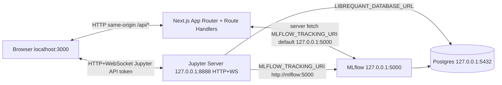

# LibreQuant


Local-first workbench for algorithmic trading research — Jupyter notebooks, strategy editing, MLflow experiments, all in one Docker-powered UI.

## Screenshot

<!-- Add a screenshot or GIF: save under e.g. screenshots/workbench.png and set src below. -->


## Prerequisites

- Docker Desktop (or Docker Engine + Compose plugin)
- Node.js 18+ and npm
- Git

## Quick start

```bash
git clone https://github.com/TomPCurran/LibreQuant.git
cd LibreQuant/librequant
cp .env.example .env.local
npm install && npm run dev:stack
```

Open [http://localhost:3000](http://localhost:3000).

## Architecture



The browser loads the Next.js app on port 3000. Same-origin `/api/*` routes proxy MLflow and other backends. The UI talks to Jupyter over HTTP/WebSocket on loopback; Jupyter and MLflow persist state in Postgres. Inside Docker Compose, Jupyter reaches `postgres` and `mlflow` by service hostname. See [librequant/SECURITY.md](librequant/SECURITY.md) for the local threat model (bind addresses, tokens, `MLFLOW_PROXY_REQUIRE_LOOPBACK`).

## Services & ports

| Service    | Default port | Bound to  |
| ---------- | ------------ | --------- |
| Next.js    | 3000         | 0.0.0.0   |
| Jupyter    | 8888         | 127.0.0.1 |
| MLflow     | 5000         | 127.0.0.1 |
| PostgreSQL | 5432         | 127.0.0.1 |

## Environment variables

Create `librequant/.env.local` from [librequant/.env.example](librequant/.env.example). Optional repo-root `.env` can override Compose ports or the Jupyter workspace host — see [env.docker.example](env.docker.example). Do not commit secrets.

## Development commands

Run **npm** from `librequant/`:

| Command | What it does |
| ------- | ------------ |
| `npm run predev` | Ensure env + copy Jupyter theme CSS (runs before `dev` via npm hook) |
| `npm run prebuild` | Same, before `build` |
| `npm run dev:stack` | Docker Compose (wait for health) + Next dev server |
| `npm run dev` | Next dev only (expects stack already up) |
| `npm run build` | Production Next.js build |
| `npm run start` | Serve production build |
| `npm run prod` | `build` then `start` |
| `npm run prod:stack` | Production-style full stack (see script) |
| `npm run lint` | ESLint |
| `npm run test` | Vitest (CI) |
| `npm run test:watch` | Vitest watch |
| `npm run test:smoke` | Local Docker smoke (needs Next on :3000); not run in CI |

Run **make** from the repo root:

| Command | What it does |
| ------- | ------------ |
| `make help` | List targets (default) |
| `make up` | Same as `npm run dev:stack` in `librequant/` |
| `make down` | `docker compose down` |
| `make reset` | `docker compose down -v` (wipes named volumes) |
| `make logs` | `docker compose logs -f` (follow service logs) |
| `make lint` | `npm run lint` in `librequant/` |
| `make test` | `npm run test` in `librequant/` |
| `make typecheck` | `npx tsc --noEmit` in `librequant/` |
| `make compose-up` | `docker compose pull && docker compose up -d` (no Next) |
| `make librequant-build` | `npm ci && npm run build` in `librequant/` |
| `make prod-build` | `librequant-build` + `compose-up` |
| `make prod` | `npm ci && npm run prod:stack` in `librequant/` |
| `make gemini-copy` | Rsync `librequant/` → `gemini_copy/` (AI tooling) |
| `make clean-gemini-copy` | Remove `gemini_copy/` |

## Project structure

```text
librequant/          — Next.js application
  app/               — App Router pages and API routes
  components/        — React UI components
  lib/               — Shared TypeScript modules
packages/librequant/ — Python library (used inside Jupyter)
docker/              — Dockerfiles for Jupyter, MLflow
docs/                — Static project page
```

## Contributing

See [CONTRIBUTING.md](CONTRIBUTING.md).

## Security

LibreQuant is designed for local use. Compose services bind to **127.0.0.1** by default (Next dev listens on all interfaces). Details: [librequant/SECURITY.md](librequant/SECURITY.md).

## License

[MIT](LICENSE).
